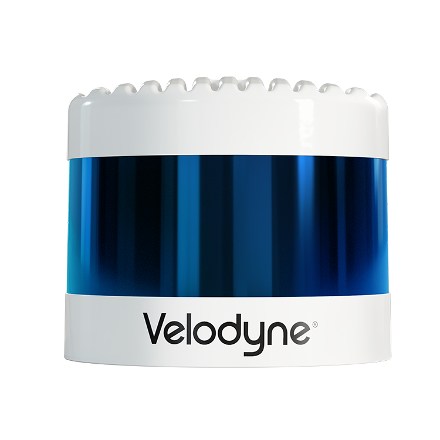
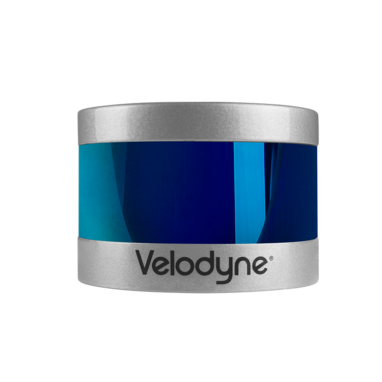
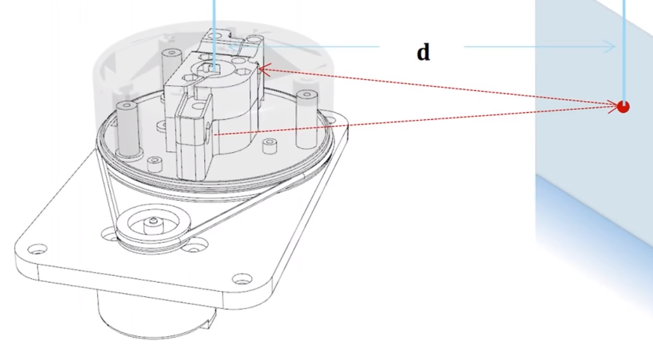
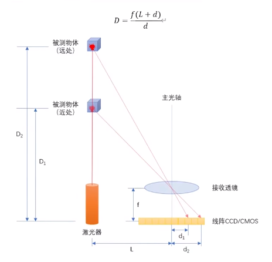
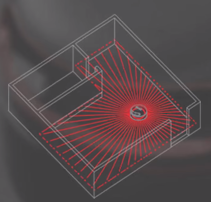
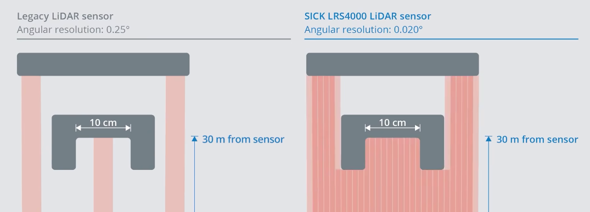
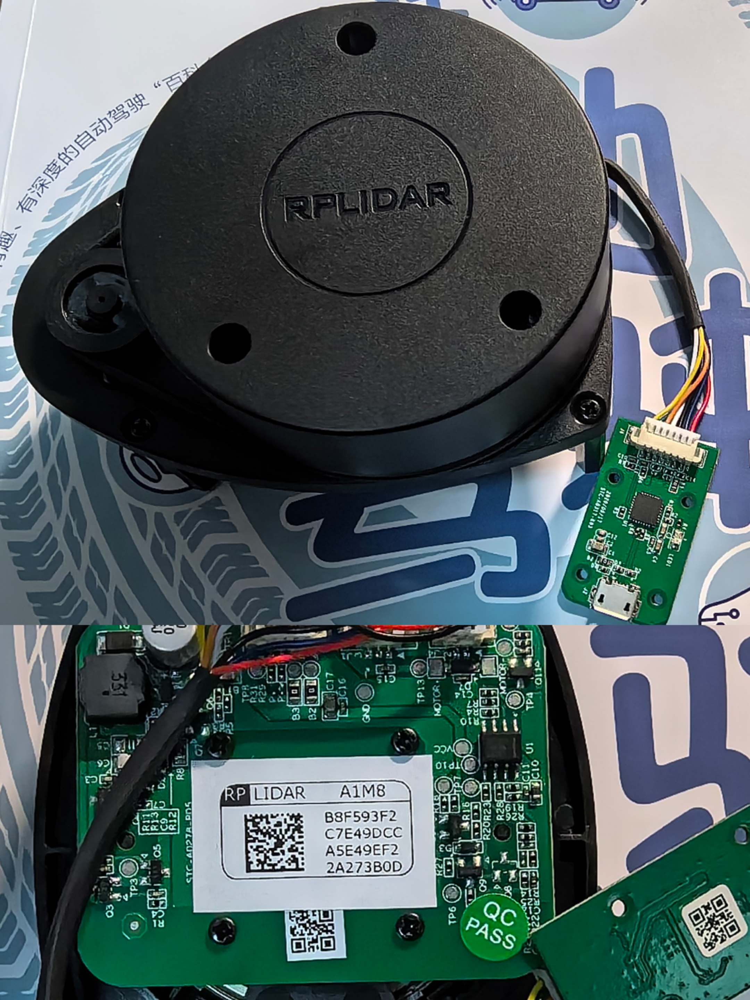

# 大话自动驾驶

[toc]

# 第一篇 硬件那些事

## 01 雷达

车载雷达
1. 激光雷达
2. 毫米波雷达

### 1.1 “镜子”，激光雷达撬起前装量产的支点

路线
1. （少数派）纯相机 - 第一性原理 - 更接近人眼
2. （多数派）激光雷达 & 相机 - 多传感器融合
   1. 激光雷达（主力） - 技术演进路线发散
   2. 中间过渡 - 混合固态激光雷达

**1.1.1 机械旋转式激光雷达**
1. 组成 - 发射模块、扫描模块、接收模块
2. 原理 - 见后续**拓展阅读**
3. 机械旋转式雷达原理决定了他要实现多少数量线束的点云效果，就需要有多少组激光发射器和接收器，其成本、体积、装调难度又直接和线束数量成正比
4. 无法量产原因
   1. 成本 - 难以满足主机厂对前装量产的单颗激光雷达的默认成本：**价格低于1000美元，等效线束大于64线** - 成本集中在激光发射器和接收器
   2. 车规 - 激光雷达是高精密的传感器，不像是雨刮器（电机轴承磨损问题不大）。需要在高温、震动的场景下保持高质量的点云及测距质量
   3. 造型 - 不够含蓄
   4. 制造 - 之前 [Velodyne](https://velodynelidar.com/) 是唯一的高线束激光雷达供应商，供货周期长，校准麻烦（每个激光发射器和接收器都需要人工校准）
   

5. 针对以上通电，激光雷达厂商退出面向前装量产的混合固态激光雷达

**1.1.2 混合固态激光雷达**

####  拓展阅读

[激光雷达工作原理 - 机器人工匠阿杰](https://www.bilibili.com/video/BV1He41137KK/)

[三角测距与TOF测距激光雷达有什么区别？影响建图导航避障的关键因素又是什么？ - 亚博智能科技](https://www.bilibili.com/video/BV1za411D7bh/)

[Velodyne Laser Teardown - YouTube](https://www.youtube.com/watch?v=bUVtT7Gp2Z4) 或 [Velodyne创始人Bruce Hall详解HDL-64激光雷达传感器内部结构和原理 - Bilibili](https://www.bilibili.com/video/BV17e41147zS/)

激光雷达（按**测量维度**分）
1. 单线 - 一个发射器和接收器 - 在角频率及灵敏度上反应更快捷 - 只能在单一的平面扫描，不能测量轮廓和高度 - 应用在扫地机器人上
2. 多线 - 4/8/16/32/64/128线配置（线数对应雷达可同时扫描的平面个数） - 在垂直方向上有多个发射器和接收器 - 数据量庞大

激光雷达（按**测量原理**分）
1. 三角测距 - 成本低，近距离精度高，远距离精度低（对于远处，像素变化不大），不抗强光，扫描频率低 - 使用并列布置的平行轴光路（雷达可以做的低矮）
   1. 由雷达测距模块向外发射红外光线，发射到物体后，部分散射光经过透镜汇聚到线阵图像传感器上成像，位于不同距离的物体，在线阵上成像的位置亦不同
      

   2. 利用相似三角形 $\frac{L+d}{d} = \frac{D}{f}$，即$D = \frac{f*(L+d)}{d}$
      

2. TOF - Time of Flight（原理直观）
   1. 固定底座 + 可旋转头部结构(红外发射器+红外接收器)
   2. 系统设计比三角测距复杂，成本更高；环境适应性更好；扫描频率高；可用于远距离；测量精度高
   3. 应用于服务机器人、AGV（Automated Guided Vehicle）、低速物流车
   4. $D = \frac{T_{flight} * V_{light}}{2}$
   5. 在一个角度，发射激光并接收（漫反射）。旋转一个角度，发射激光并接收。不断重复该过程

激光雷达（按**工作方式**分）
1. 机械旋转
2. 固态雷达

雷达选型
1. **角分辨率** - 雷达采样过程中相邻两点之间的夹角（雷达的指向精度），越小雷达获取的信息越细致
   

2. **采样频率** - 每秒进行多少次测距输出
3. **扫描频率** - 每秒雷达进行多少次扫描（雷达中电机旋转次数），需要与采样频率配套，否则扫描频率过高将降低角分辨率
4. 测量半径 - 雷达能够测量的最远距离
5. 光照强度 - 表示雷达能够正常工作的最大光照强度 - 单位：流明

目前手上有一款 [思岚 RPLIDAR-A1M8](https://www.slamtec.com/cn/Lidar/A1) （三角测距） - 后续研究研究

## 02 相机

## 03 定位

## 04 芯片

## 05 线控底盘

# 第二篇 软件那些事

## 06 算法

## 07 系统

## 08 功能

# 第三篇 行业那些事

## 09 行业杂谈

## 

