# 大话自动驾驶

[toc]

---

# 第一篇 硬件那些事

## 01 雷达

车载雷达
1. 激光雷达
2. 毫米波雷达

### 1.1 “镜子”，激光雷达撬起前装量产的支点

路线
1. （少数派）纯相机 - 第一性原理 - 更接近人眼
2. （多数派）激光雷达 & 相机 - 多传感器融合
   1. 激光雷达（主力） - 技术演进路线发散
   2. 中间过渡 - 混合固态激光雷达

#### 1.1.1 机械旋转式激光雷达
1. 组成 - 发射模块、扫描模块、接收模块
2. 原理 - 见后续**拓展阅读**
3. 机械旋转式雷达原理决定了他要实现多少数量线束的点云效果，就需要有多少组激光发射器和接收器，其成本、体积、装调难度又直接和线束数量成正比
4. 无法量产原因
   1. 成本 - 难以满足主机厂对前装量产的单颗激光雷达的默认成本：**价格低于1000美元，等效线束大于64线** - 成本集中在激光发射器和接收器
   2. 车规 - 激光雷达是高精密的传感器，不像是雨刮器（电机轴承磨损问题不大）。需要在高温、震动的场景下保持高质量的点云及测距质量
   3. 造型 - 不够含蓄
   4. 制造 - 之前 [Velodyne](https://velodynelidar.com/) 是唯一的高线束激光雷达供应商，供货周期长，校准麻烦（每个激光发射器和接收器都需要人工校准）
   

5. 针对以上通电，激光雷达厂商退出面向前装量产的混合固态激光雷达

---

####  拓展阅读

[激光雷达工作原理 - 机器人工匠阿杰](https://www.bilibili.com/video/BV1He41137KK/)

[三角测距与TOF测距激光雷达有什么区别？影响建图导航避障的关键因素又是什么？ - 亚博智能科技](https://www.bilibili.com/video/BV1za411D7bh/)

激光雷达（按**测量维度**分）
1. 单线 - 一个发射器和接收器 - 在角频率及灵敏度上反应更快捷 - 只能在单一的平面扫描，不能测量轮廓和高度 - 应用在扫地机器人上
2. 多线 - 4/8/16/32/64/128线配置（线数对应雷达可同时扫描的平面个数） - 在垂直方向上有多个发射器和接收器 - 数据量庞大

激光雷达（按**测量原理**分）
1. 三角测距 - 成本低，近距离精度高，远距离精度低（对于远处，像素变化不大），不抗强光，扫描频率低 - 使用并列布置的平行轴光路（雷达可以做的低矮）
   1. 由雷达测距模块向外发射红外光线，发射到物体后，部分散射光经过透镜汇聚到线阵图像传感器上成像，位于不同距离的物体，在线阵上成像的位置亦不同
      

   2. 利用相似三角形 $\frac{L+d}{d} = \frac{D}{f}$，即$D = \frac{f*(L+d)}{d}$
      

2. TOF - Time of Flight（原理直观）
   1. 固定底座 + 可旋转头部结构(红外发射器+红外接收器)
   2. 系统设计比三角测距复杂，成本更高；环境适应性更好；扫描频率高；可用于远距离；测量精度高
   3. 应用于服务机器人、AGV（Automated Guided Vehicle）、低速物流车
   4. $D = \frac{T_{flight} * V_{light}}{2}$
   5. 在一个角度，发射激光并接收（漫反射）。旋转一个角度，发射激光并接收。不断重复该过程

激光雷达（按**工作方式**分）
1. 机械旋转
2. 固态雷达

雷达选型
1. **角分辨率** - 雷达采样过程中相邻两点之间的夹角（雷达的指向精度），越小雷达获取的信息越细致
   

2. **采样频率** - 每秒进行多少次测距输出
3. **扫描频率** - 每秒雷达进行多少次扫描（雷达中电机旋转次数），需要与采样频率配套，否则扫描频率过高将降低角分辨率
4. 测量半径 - 雷达能够测量的最远距离
5. 光照强度 - 表示雷达能够正常工作的最大光照强度 - 单位：流明

[Velodyne Laser Teardown - YouTube](https://www.youtube.com/watch?v=bUVtT7Gp2Z4) 或 [Velodyne创始人Bruce Hall详解HDL-64激光雷达传感器内部结构和原理 - Bilibili](https://www.bilibili.com/video/BV17e41147zS/)

英文全称
1. Radar - Radio Detection and Ranging - 无线电探测与测距
2. LiDAR - Light(Laser) Detection and Ranging - 光探测与测距

多线激光雷达
1. 下图为Velodyne公司的64线激光雷达HDL_64E - 该雷达前端上下分布有四组激光发射器（每组16个发射器，共64个）和两组激光接受器（每组32个激光接收器APD，共64个） - 每转单个激光器发射约4000次
   
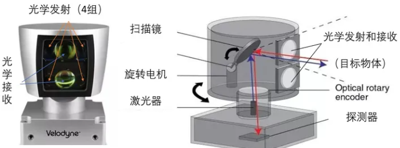

   
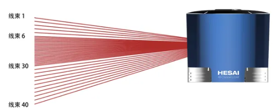

2. 激光雷达 = 激光发射+激光接收+信息处理+扫描系统
   1. 激光发射系统：激励源周期性地驱动激光器，发射激光脉冲，**激光调制器**通过光束控制器控制发射激光的方向和线数，最后通过发射光学系统，将激光发射至目标物体
   2. 激光接收系统：经接收光学系统，光电探测器接受目标物体反射回来的激光，产生接收信号
   3. 信息处理系统：接收信号经过放大处理和数模转换，经由信息处理模块计算，获取目标表面形态、物理属性等特性，最终建立物体模型
   4. 扫描系统：以稳定的转速旋转起来，实现对所在平面的扫描，并产生实时的平面图信息
   
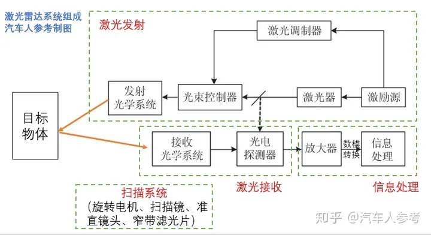

   
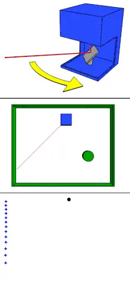

3. 多线激光雷达数据结构（以N线为例）
   1. 时间戳
   2. 单线点云数据*N
      1. 点云数量
      2. 单点云数据*点云数量
         1. X、Y、Z方向偏移
         2. 反射强度
   

激光光束空间编码（利用激光束的相干性和横向能量分布）
1. 应用 - 雷达探测、靶向导航、星际通讯
2. 优势 - 传输距离远、传输速度快、信息容量大、抗干扰能力强

[结构光](https://zhuanlan.zhihu.com/p/54761392)
1. 线扫描结构光
2. 面阵结构光
   1. 随机结构光
   2. 编码结构光
      1. 时序编码（二进制码/格雷码） 
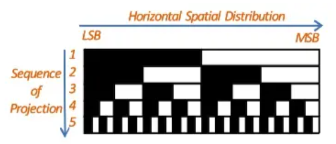

      3. 空间编码（向被测空间中投影经过数学编码的、一定范围内的光斑不具备重复性的结构光）
         1. 德布鲁因序列 (De Bruijn) （可以拓展至二维） 
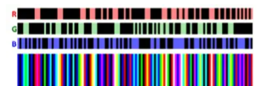

目前手上有一款 [思岚 RPLIDAR-A1M8](https://www.slamtec.com/cn/Lidar/A1) （三角测距） - 后续研究研究

超声波雷达（Ultrasonic Sensor System） - 价格低廉，低速场景，探测距离短，障碍物的形状和位置难以判断 - 场景：泊车辅助报警
1. LRU - Long Range Unit - 检测距离通常在30-500cm，也有的能够超过700cm，检测角度较小，通常作为APA（Active Park Assist System）传感器安装在车身侧面
2. SRU - Short Range Unit - 检测距离通常在15-250cm，通常作为UPA（Ultrasonic Park Assist System）传感器安装在前后保险杠

[超清晰！几分钟讲清激光雷达的工作原理](https://www.bilibili.com/video/BV1z5411774u/)

Airborne LiDAR
1. LiDAR Unit + GPS + IMU + Computer
2. 飞机上的雷达系统采用绿波段或者近红外波段（地表植被会对这两种光有较强的反射）
   
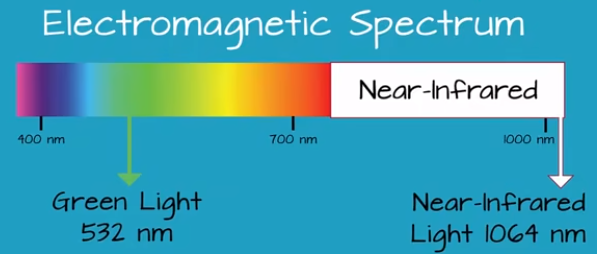

---

#### 1.1.2 混合固态激光雷达

混合固态激光雷达
1. 发射模块和接收模块不再进行360°旋转，而是通过“镜子”的一维或二维往复旋转实现激光线束的扫描
2. “镜子”
   1. 棱镜
      1. 厂商 - [Livox](https://www.livoxtech.com/cn) （母公司大疆）
      2. 非重复扫描技术，0.1s积分时间内，扫描覆盖率≈64线激光雷达 （减少激光收发器（主要成本））
         
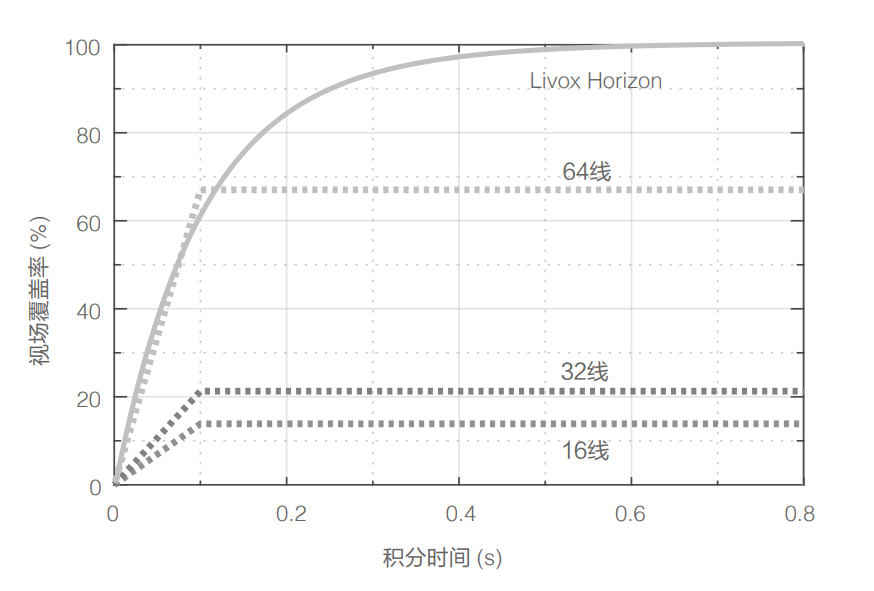

         这个覆盖率只是针对Livox自己的视场FOV(field of view)（对于传统激光雷达，0.1秒后已经探测其他区域了）
      3. 解决方案 - 采用**空间激光通信领域的旋转双棱镜（光楔）**，电机带动双棱镜旋转，电机转速不同，扫描图案不同
         1. 收发模块(Transceiver) : PLD(pulsed laser diode)发射器、APD(avalanche photodetector)接收器
         2. 扫描模块(Scanner) : coil线圈、prism棱镜、bearing轴承
         3. 首先收发模块的PLD发射出激光，通过反射镜和凸透镜使之变成平行光，然后扫描模块的两个旋转的棱镜改变光路，使激光从某个角度发射出去。激光打到物体上，会从原光路反射回来，被APD所接收（发射光路和接受光路的孔径不同，反射镜的尺寸是通过精心调整的）
         4. 通过这样的设计，极大地减少了激光发射和接收的线数，也随之降低了对焦与标定的复杂度，因此生产效率得以大幅提升，物料成本的减少和生产效率的提升使得棱镜LiDAR成本相比于传统机械式LiDAR有了大幅的下降
         
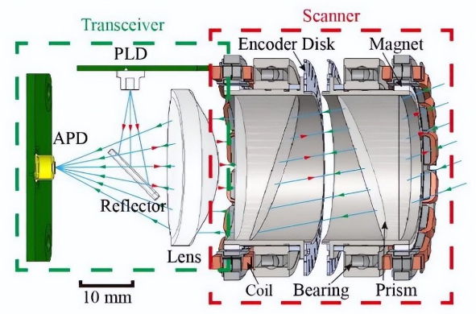

         
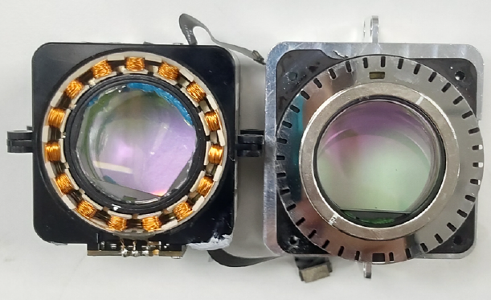

         通过对两个棱镜转速的调整，LiDAR会获得不同扫描图案（下图分别为螺旋式和花瓣式的扫描图案）
         
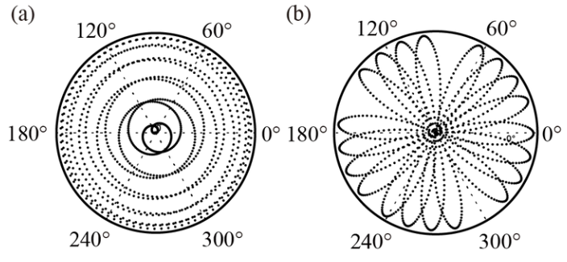

         猜测应该用了6个激光收发组件
         
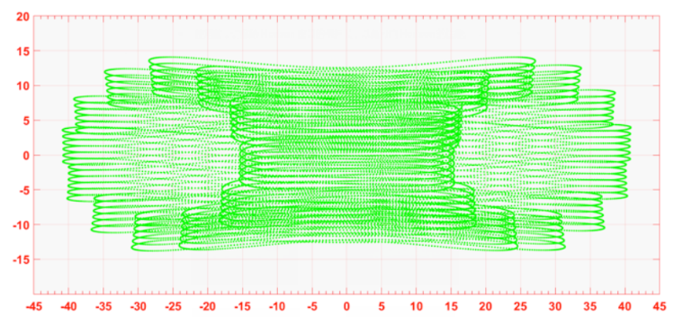

         扫描过的地方不会再次进行扫描，随着时间的增加，被扫描到的地方会越来越多，点云也会越来越密集
         
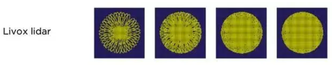

         
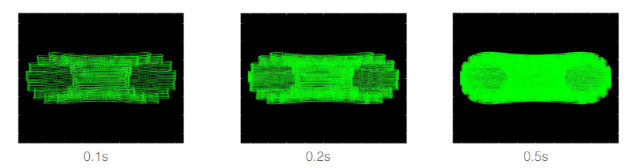

      4. 激光收发模块固定，电机仅带动棱镜旋转，避免多次装调问题，提高量产能力
      5. 车规方面，双棱镜单位时间转速较快，电机转速高达6000r/min
   2. 转镜
      1. 厂商
         1. 国内 - 禾赛科技、镭神智能、华为
         2. 国外 - Ibeo、Innovusion（图达通英文名Innovusion更名为Seyond）
      2. 激光收发模块不动，电机带动扫描镜围绕其圆心旋转，将激光反射 - 专利壁垒牢固
         1. 一维转镜（一面扫描镜） - 激光扫描线束=激光收发器数量
         2. 二维转镜（两面扫描镜） - 更少的激光收发器实现相同线束
         3. 多面镜
         4. 芯片化 - 激光收发器芯片化 - 解决激光雷达 成本、质量、效率 问题
            1. 垂直腔面发射器 *VCSEL(vertical cavity surface emitting laser)* 用于代替当前主流的 边缘发射器 *EEL(edge emitting laser)*   
               
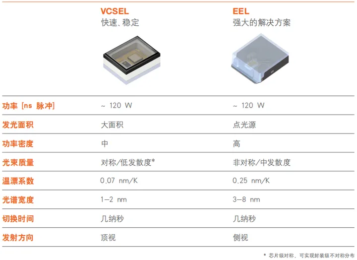

               
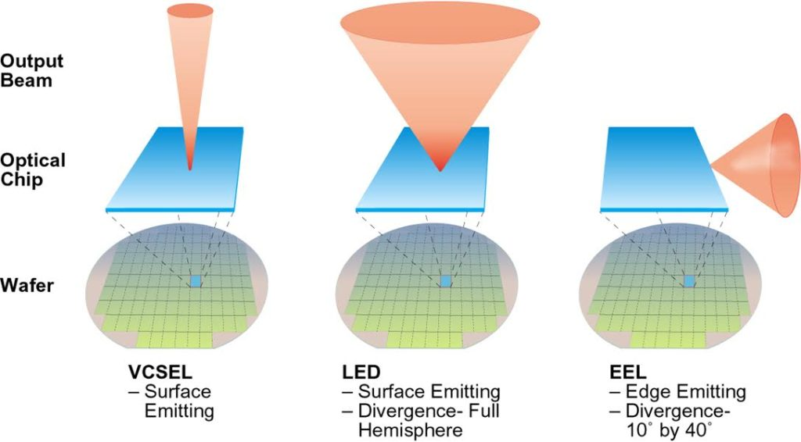

               
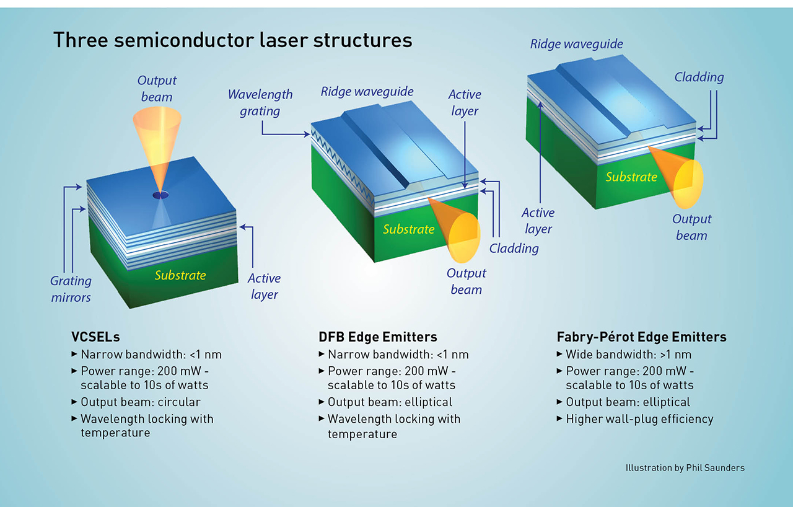

               利于芯片化，可以装成二维矩阵，但能量密度低 （EEL有高发散角，需要更高的预支电流）
            2. 单光子雪崩二极管 *SPAD(single photon avalanche diode)* 用于代替当前主流的 雪崩光电二极管 *APD(avalanche photodiode)*
               利于芯片化，但存在感光串扰问题

      3. Scala 1 - 全球首款通过车规级认证的激光雷达 - 收发搭载在奥迪A8 （Scala 2 - 搭载在奔驰 S 级车型上）
         
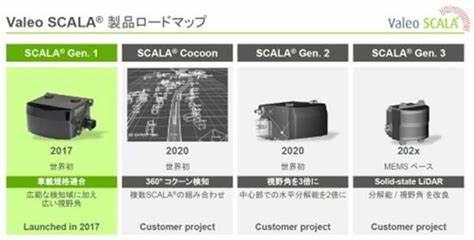

         
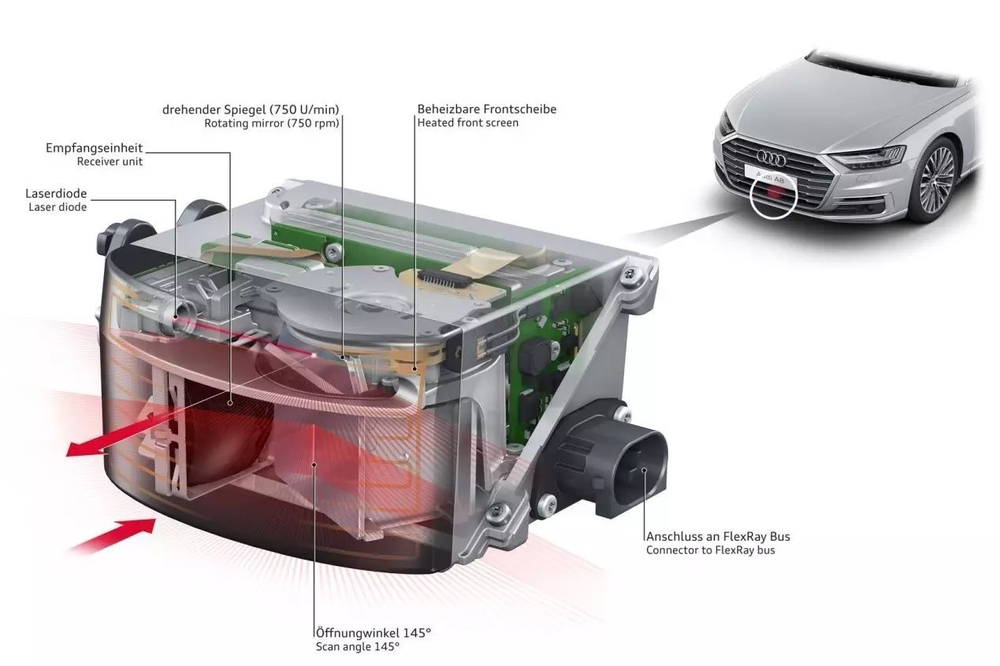

         

      4. 电机转速下降，2000r/min，仍存在高温耐久稳定性差、视场角受限、信噪比低
   3. 微机电系统微振镜 MEMS (micro electro mechanical system) 
      1. 厂商
         1. 国外 - Innoviz、Luminar
         2. 国内 - 速腾聚创、一径科技
      2. 无电机方案，激光收发模块固定，微振镜在静电、电磁、电热、压电驱动下，在水平和垂直两个自由度围绕悬臂梁做往复运动，将激光束反着到不同角度，实现水平、垂直扫描
         
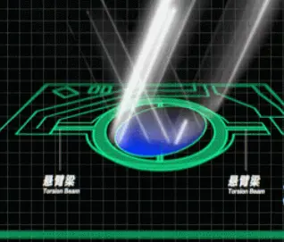

      3. 优势
         1. 减少激光收发器数量 -> 成本低
         2. 取消电机 -> 提高激光雷达可靠性
      4. 劣势
         1. 激光雷达测距能力和视场角大小与微振镜的镜面尺寸成正比
         2. 大尺寸讲过增加工艺难度、降低良品率、可靠性、稳定性
         3. 对振动敏感，材料属性会随温度、振动变化

####  拓展阅读

[小鹏 & Livox激光雷达 简析](https://www.xchuxing.com/article/28678)

[What is VCSEL Laser (Vertical Cavity Surface Emitting Laser)? - YouTube](https://www.youtube.com/watch?v=C0XvoT0Kn1k)

[SPAD vs. APD，从珠峰 vs. 巨石阵讲起](https://www.bilibili.com/read/cv20006802/)

PD（全称Photodiode，光电二极管）具有光电效应，在光照时会产生电流
1. SPAD
   1. 光子触发电子时，SPAD的电子急剧增加
   2. 优势
      1. **易于大规模集成** - 硅基SPAD可兼容CMOS，易于制作高分辨率的密集阵列
      2. **增益高** - 高增益让SPAD更为敏感，可以检测出单个光子
      3. **时间精度高** - SPAD的时间精度可达100ps，信号传输速度快
   3. 劣势
      1. SPAD在使用过程中受到环境（如环境光、温度等）干扰，也会发生雪崩，影响信号输出质量
      2. SPAD采用较高反向偏压，可由单光子触发，对目标光源非常敏感的同时，也较容易受到环境光干扰
      3. SPAD雪崩时可能会被自身的巨大电流损坏，必须先淬灭电流，重新充电后再次工作；SPAD淬灭所需的时间称为**死区时间**，从几纳秒到一微秒不等
2. APD
   1. 光子触发电子时，APD电子增加过程较为平缓
   2. 优势
      1. **连续信号采集** - APD可以连续接收信号光，无需等待时间
      2. **抗环境光干扰** - APD可以产生多数位的连续信号，受环境光干扰较小
   3. 劣势
      1. APD属于分立器件，想要用作阵列就会加大自身尺寸且价格较高
      2. APD本身仅能对光强进行区分，需要借助复杂的电路设计来提取时间信息

### 1.2 激光雷达，揭秘面具下隐藏的真实面目

### 1.3 4D毫米波雷达，“割韭菜第二快的刀”

## 02 相机

## 03 定位

## 04 芯片

## 05 线控底盘

# 第二篇 软件那些事

## 06 算法

## 07 系统

## 08 功能

# 第三篇 行业那些事

## 09 行业杂谈

## 

